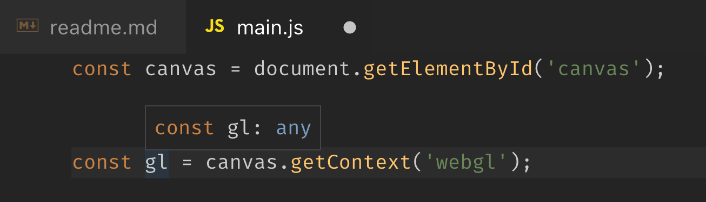
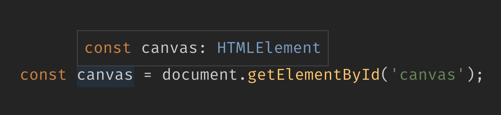
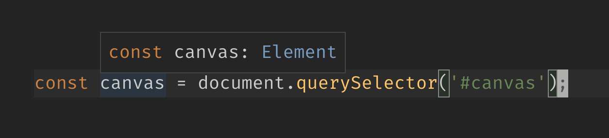
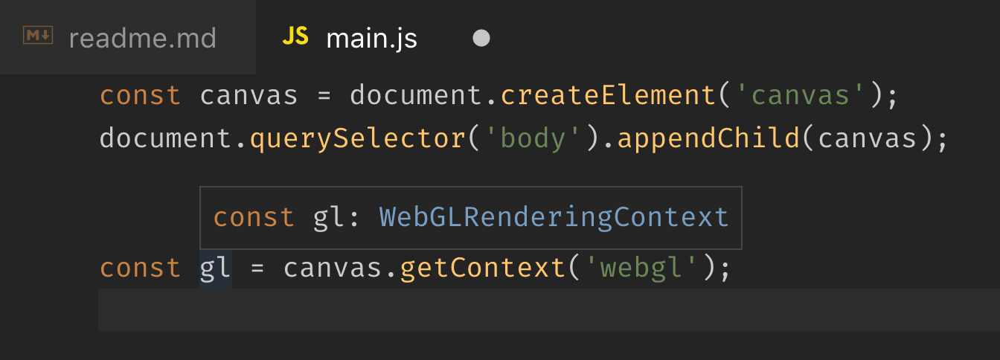
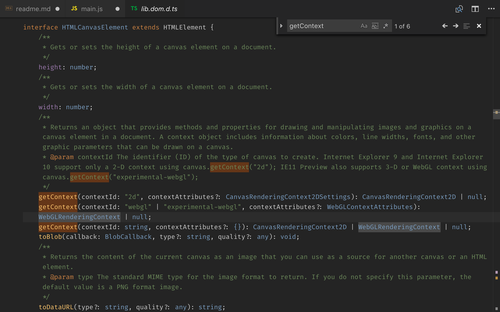
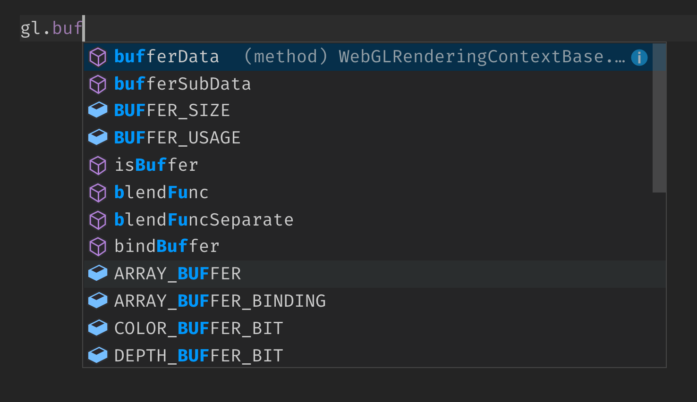
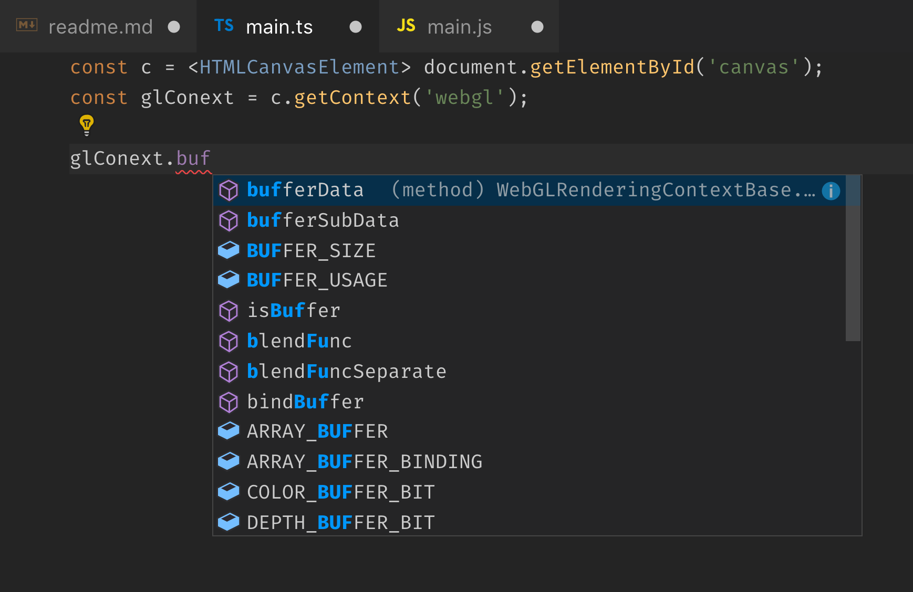

# Using VSCode for WebGL Development

I start learning about WebGL recently from WebGL Tutorials on the internet.
I create 2 files in the project: `index.html` and `main.js` to start off.
The editor I use is VSCode.

Most tutorials I have seen start like this

1. Create a `<canvas>` element in `index.html`

```html
<canvas id="canvas"></canvas>
```

2. In `main.js`, use the canvas element as a WebGL rendering context

```js
const canvas = document.getElementById('canvas'); // or document.querySelector('#canvas')
const gl = canvas.getContext('webgl');
```

Then use `gl` object for .. basically almost everything.

```js
// methods
gl.clearColor(0.0, 0.0, 0.0, 1.0);
gl.attachShader();
gl.vertexAttrib1f();
gl.getAttribLocation();

// constants
gl.COLOR_BUFFER_BIT;
gl.VERTEX_SHADER;
gl.COMPILE_STATUS;
```

The problem I had was that VSCode was unable to display code [IntelliSense](https://code.visualstudio.com/docs/editor/intellisense)
for `gl` object because VSCode finds it has the type of `any` -
VSCode does not know what type of the object is, thus it cannot help.



First I thought it would be fine, I can get along with this.

In fact, the `gl` object has type of `WebGLRenderingContext`. And if we check [the specs of this interface](https://www.khronos.org/registry/webgl/specs/latest/1.0/#5.14),
there are **over 200 properties (constants) and methods** in this object type.

There is 0% chance that I could remember them all,
and there are more than 87.525% chance that I will make a typo in the code when typing those property and method names manually by hand.

## How to get help from VSCode? 🤔

The real problem is that VSCode cannot guess the type of returned `canvas` element.

By using `document.getElementById()`, we got `HTMLElement` type returned.



By using `document.querySelector()`, we got `Element` type returned.



### Option 1: use `document.createElement()`

Instead of pre-create `<canvas>` element in the HTML, we can alo create it in JavaScript code and put it in the page via `appendChild()`.

```js
const canvas = document.createElement('canvas');
document.querySelector('body').appendChild(canvas);

const gl = canvas.getContext('webgl');
```

Creating a canvas with `document.createElement('canvas')`,
VSCode knows that it has type of `HTMLCanvasElement` which gives a better sense with calling `.getContext()` on it.



Passing in `webgl` as a parameter, VSCode knows the return type of the method that should be `WebGLRenderingContext` type.


(built-in `lib.dom.d.ts` type definitions file in VSCode)

Now we can get code autocompletion our `gl` object working.



### Option 2: Use TypeScript's Type Assertion

If the project is using TypeScript, we can use [Type Assertion](https://www.typescriptlang.org/docs/handbook/basic-types.html) to tell VSCode about the canvas object type.

```ts
const canvas = <HTMLCanvasElement>document.getElementById('canvas');
```

This tells the TypeScript compiler to treat `canvas` object as `HTMLCanvasElement` type, instead of the default `HTMLElement` type. (It is not the same with type casting though.)

When VSCode knows the type, it shows the code IntelliSense like so.



---

## Setting up TypeScript in My Learning Project

I started the learning project with vanilla JavaScript because I wanted to avoid setting up build tools if I don't need them.
With TypeScript, this is unavoidable. At least we have to set up some build steps to transpile TypeScript to JavaScript.

Here is how I set up webpack (with my very limited knowledge about webpack) to use TypeScript.

1. Install TypeScript

```sh
$ npm install --save-dev typescript
```

2. Install webpack

```sh
$ npm install --save-dev webpack webpack-dev-server
```

3. Install TypeScript loader with sourcemaps support

```sh
$ npm install --save-dev awesome-typescript-loader source-map-loader
```

_or you can install everything above in a single command._

4. Create `webpack.config.js` configuration file for webpack.

```js
const path = require('path');

module.exports = {
	mode: 'development',
	entry: './src/index.ts',
	output: {
		filename: 'main.js',
		path: path.resolve(__dirname, 'dist')
	},
	devServer: {
		contentBase: './dist'
	},
	resolve: {
		extensions: ['.ts', '.tsx']
	},
	devtool: 'source-map',
	module: {
		rules: [
			{
				test: /\.tsx?$/,
				loader: 'awesome-typescript-loader'
			}
		]
	}
};
```

5. Start the dev server

```sh
$ npx webpack-dev-server
```
